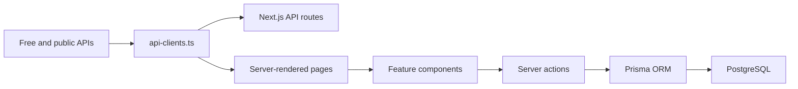

# Eagle Quantitative Architecture

## Product Architecture

Eagle Quantitative is organized as a Next.js 15 App Router application with server-rendered product pages, client-side analytical workspaces, API routes, NextAuth.js authentication, Prisma ORM, and PostgreSQL persistence.

## Folder Structure

```text
src/
  app/
    api/                         Next.js API routes
    (platform)/                  Auth-ready product routes with app shell
    about/ contact/ pricing/     Marketing routes
    actions.ts                   Server actions
    layout.tsx                   Metadata, viewport, root shell
    sitemap.ts robots.ts         SEO infrastructure
  auth.ts                        NextAuth.js configuration
  components/
    charts/                      Recharts and analytical visuals
    features/                    Screener, portfolio, research, AI, news
    landing/                     Landing-page market scene
    layout/                      Product navigation and app shell
    marketing/                   Marketing header and footer
    market/                      Market widgets and headings
    ui/                          Shadcn-style primitives
  lib/
    analytics.ts                 Backtest and portfolio calculations
    api-clients.ts               Free/public data provider adapters
    mock-data.ts                 Deterministic fallback data
    prisma.ts                    Prisma client singleton
    types.ts                     Financial domain types
    utils.ts                     Formatting and UI helpers
prisma/schema.prisma             ORM models
database/schema.sql              SQL schema
docs/                            Delivery, security, and architecture docs
```

## UI Component Architecture

- `ui/*`: low-level accessible primitives such as Button, Card, Badge, Input, Select, Table, and Progress.
- `charts/*`: client-only chart components built with Recharts for market, sentiment, portfolio, and backtest visuals.
- `market/*`: reusable financial display components such as tickers, metric cards, and page headings.
- `features/*`: complete domain workflows, including Stock Screener, Portfolio Tracker, Quant Research Lab, News Sentiment Hub, and AI Insights.
- `layout/*`: institutional product shell with persistent navigation and ticker.
- `marketing/*`: SaaS pages and public navigation.

## API Integration Layer

Provider access is centralized in `src/lib/api-clients.ts`. Each function prefers a live public/free API when a matching environment key is configured, and falls back to deterministic sample data when keys are unavailable.

Supported providers:

- Alpha Vantage for market quotes
- Financial Modeling Prep for stock and ETF data
- Twelve Data for market quote expansion
- CoinGecko for crypto markets
- NewsAPI and GNews for news
- FRED for macroeconomic series
- SEC EDGAR and SEC XBRL for filings and fundamentals
- Senate and House disclosure datasets for congressional trading
- Hugging Face Inference API for FinBERT sentiment
- OpenAI-compatible endpoints for AI insight generation

## Backend Surface

API routes expose normalized JSON resources:

- `GET /api/market/overview`
- `GET /api/screener`
- `GET /api/insiders`
- `GET /api/congress`
- `GET /api/crypto`
- `GET /api/news?symbol=NVDA`
- `GET /api/economic-calendar`
- `GET /api/ai/insights`
- `GET /api/portfolio`
- `POST /api/research/backtest`

Server actions persist user-owned workflows:

- `saveScreenAction`
- `saveResearchRunAction`

## Database Model

The Prisma schema supports:

- NextAuth users, accounts, sessions, and verification tokens
- Portfolios and holdings
- Watchlists and watchlist items
- Saved stock screens
- Quant research runs
- Trade disclosures for insiders and public officials
- User alerts
- Provider API cache

## Data Flow



## Production Scaling Notes

- Use provider-specific cache windows to avoid free-tier rate limits.
- Store provider responses in `ApiCache` for expensive endpoints.
- Move heavy filings ingestion into scheduled jobs or background workers.
- Keep portfolio and research mutations behind authenticated server actions.
- Add row-level ownership checks to every user-owned write.
- For institutional tenants, add organization, role, and audit-log models.

